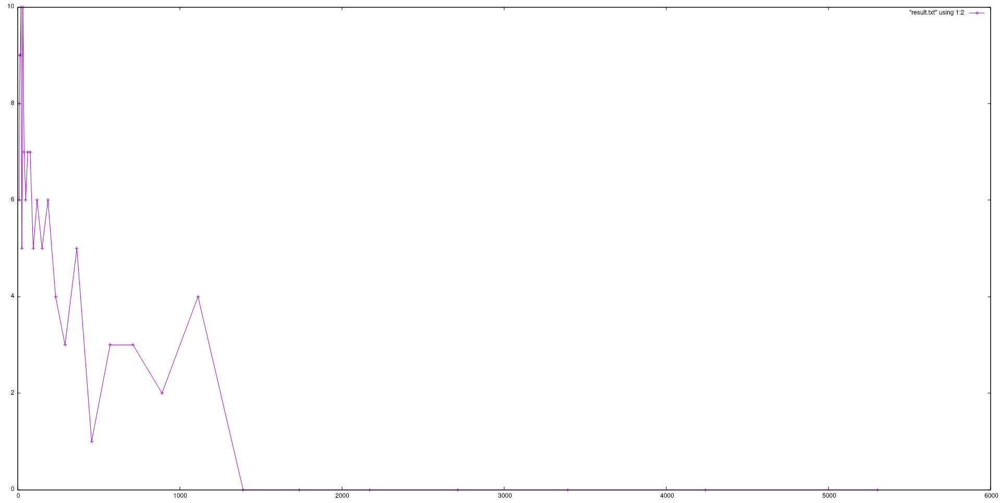

=====================
Лабораторна робота №1
=====================
**Завдання:**

* Нужно написать на С программу, которая:

* запускает два потока (используя pthread);

* каждый поток увеличивает значение глобальной переменной на 1 в цикле 100000000 раз

* в конце делает join потоков и выводит полученное значение переменной

* собрать с флагами -O0 и -O2 для x86 и для платы

* сравнить и объяснить полученные результаты

**Хід роботи:**

* Для початку необхідно розархівувати та записати на SD-карту операційну систему Debian Stretch for BeagleBoard.
  Виконується за допомогою команди:
.. code-block::

  sudo sh -c "xz --decompress --keep --stdout bbxm-debian.img.xz | dd status=progress bs=4M of=/dev/mmcblk1; sync"

* Далі вставляємо SD-карту в ВВХМ та підключаємо джерело живлення.

* Переконуємось, що софтверний USB-хаб *ID 1d6b:0104 Linux Foundation Multifunction Composite Gadget* присутній.
  Для цього виконуємо команду "lsusb"

* Налаштовуємо IP адресс вручну (192.168.7.1/24). 

* Перевіряємо, що мережеві пакети доходять нормально за допомогою команди *ping 192.168.7.2*

* Підключаємось до ВВХМ по ssh. Пароль: *temppwd*, Логін: *debian*.
  Виконуємо команду "*ssh debian@192.168.7.2*" після чого вводимо пароль.

* Програма була скомпільована з прапорами -O0 та -O2 та запущена в архітектурі x86 та ARM.

* Результати наведені нижче:

  **Опис програми:**

...

10.Збираємо та запускаємо программу на платформах х86 та ARM.
Результатом для х86 буде:
*з флагом -O0: 0.486631 секунд та 0.490275 секунд
*з флагом -O2: 0.00006 секунд та 0.000708 секунд
Результатом для ARM буде:
*з флагом -O0: 1.506652 секунд та 1.502990 секунд
*з флагом -O2: 0.000153 секунд та 0.000092 секунд

 
