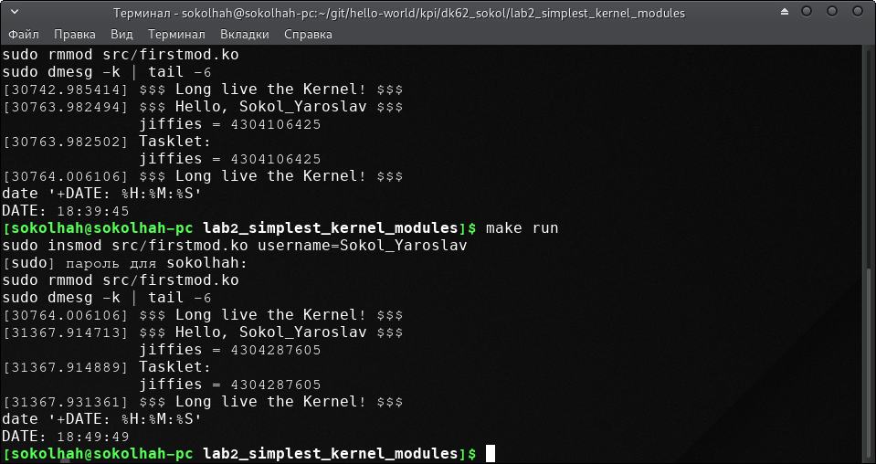
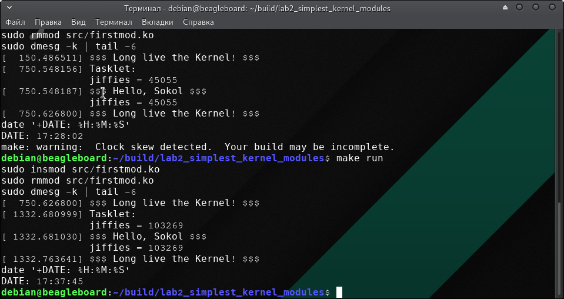

=====================
Лабораторна робота №2
=====================
**Завдання:**

* подправить модуль из примера, что бы вместо ``username``, выводилось имя, переданное в качестве параметра модуля при его подключении ``insmod``

* изучить материалы INOB

* добавить в ``init`` полученного модуля ядра тасклет, который также выведет текущее значение jiffies

* объяснить, почему разница между двумя выводимыми jiffies (в init и в тасклете) может быть равна 0, 1 или 2

---------------------

**Хід роботи:**

* Для початку необхідно завантажити пакет для оновлення ядра. Для цього можна використати команду ''uname -r''. Для роботи було встановлено версія ''4.19.69-1-MANJARO'', тому для подальшої роботи з х86 виконуємо команду:
''pacman -Syy linux419 linux419-headers  linux419-ndiswrapper''.

* Для роботи з ВВХМ необхідно було встановити заголовки. Для цього необхідно скачати заголовки з ''http://repos.rcn-ee.com/debian/pool/main/l/linux-upstream/'' та скачати файл ''linux-headers-4.18.11-armv7-x11_1stretch_armhf.deb''.

* Далі було дороблено  та зібрано модуль ядра, який створює вихідний файл *firstmod.ko*. Виконується за допомогою ``sudo insmod``.

* Для вигруження модуля використовуємо: ``sudo rmmod``.

* Для логів ядра(останніх 5 рядків) використовуємо: ``sudo dmesg -k | tail -5``.

* Далі необхідно було виміряти час між двома включеннями модуля на х86 та ВВХМ, інтервал між якими був 10 хвилин. Для збільшення точності в Makefile після виклику команти перегляду логів ядра викликається команда яка відображує системний час 
.. code-block::

  date '+DATE: %H:%M:%S'

* Результатом для х86 наведено нижче:

* Результатом для arm наведено нижче:

* Для розрахунку 1 ''jiffies'' в мілісекундах виконується формула:
  ''delta jiffies / Hz * 1000''

* Отже, для платформи х86: 1 ''jiffies = (4299689219 - 4299444453) / 300 * 1000 = 8155886 мс'', в той час як між процесами пройшло ''(35 - 21) * 60 + (15 - 44) = 811'' секунд.

* А для платформи arm: 1 ''jiffies = (168308 - 87888) / 250 * 1000 = 804200 мс'', в той час як між процесами пройшло ''(48 - 35) * 60 + (39 - 25) = 794'' секунд.
  
---------------------

**Висновок:**

Проаналізувавши даний результат можна сказати, що в теорії було розраховано очікувати результат 600 секунд, але за рахунок похибки, яка складає 0,5%. Звідси можна сказати що результат є саме таким, який повинен бути. Тому, значення jiffies можна вважати реальним годинником. Якщо глобальніше дізнатись про це значення, то дана змінна показує кількість імпульсів системного таймеру, які були отримані з моменту завантаження системи. З даних свідчень можна сказати, що і для ВВХМ повинен бути приблизно такий же результат.

